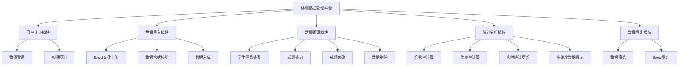
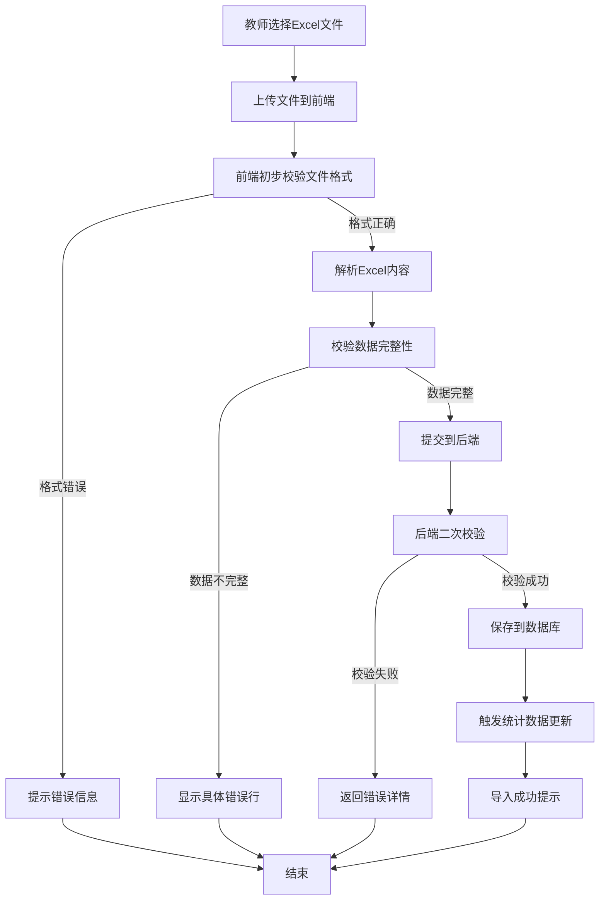
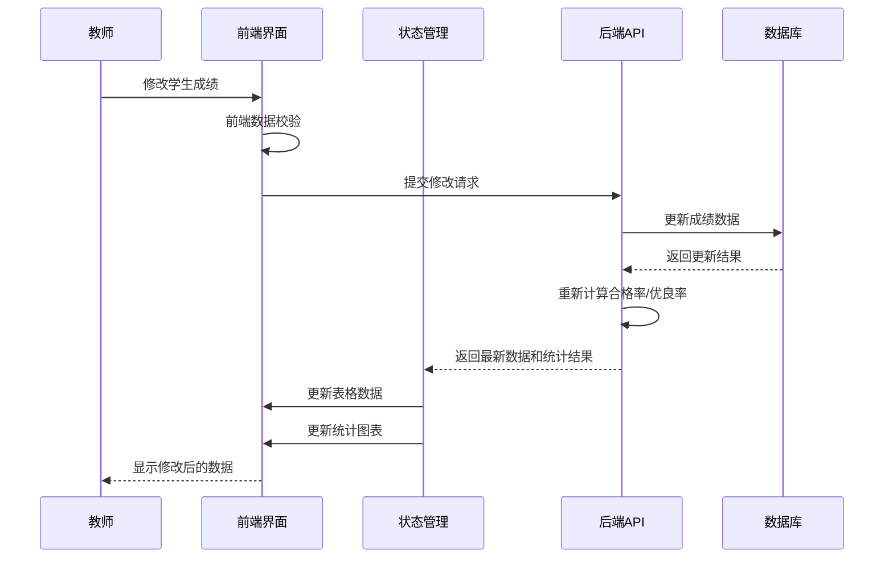
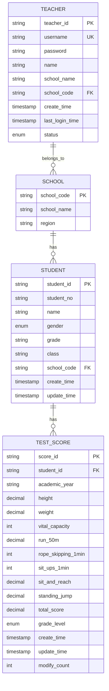
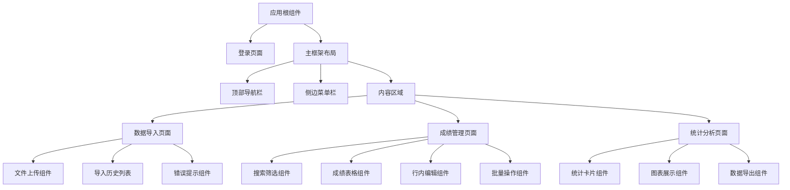
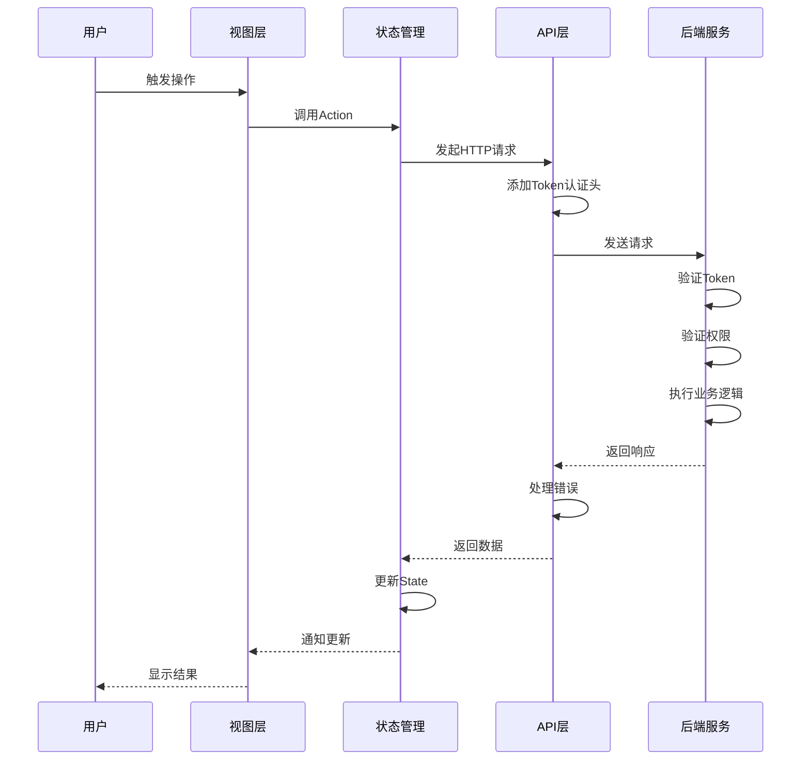
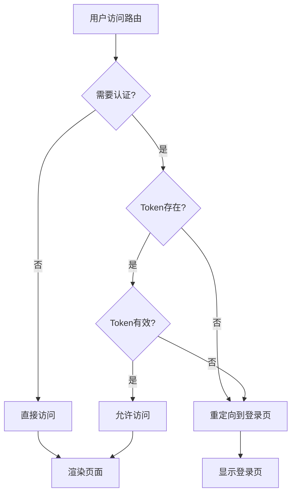

# 体测数据管理平台设计文档

## 1. 概述

### 1.1 系统定位
本平台是一个面向学校教师的体测数据管理系统,旨在帮助教师便捷地管理、修改和导出学生年度体测成绩数据,并实时查看学校整体的体测数据统计指标。

### 1.2 核心价值
- 集中管理各学校学生的国家标准体测数据
- 提供Excel批量导入导出能力,简化数据录入流程
- 支持数据实时修改,统计指标同步更新
- 帮助教师优化体测成绩,达到理想的合格率和优良率

### 1.3 用户角色
- **教师用户**: 各学校教师,拥有独立账号,仅能管理本校学生数据
- **系统管理员**: 负责创建和分配教师账号

### 1.4 技术栈
- 前端: Vue3 + Element Plus + Vite
- 体测标准: 国家2014版本体测项目要求

## 2. 功能架构

### 2.1 系统功能模块

### 2.2 核心业务流程

#### 2.2.1 数据导入流程

#### 2.2.2 数据修改与实时统计流程

## 3. 数据模型设计

### 3.1 核心实体定义

#### 3.1.1 教师账号实体
| 字段名 | 类型 | 说明 | 约束 |
|--------|------|------|------|
| 教师ID | 字符串 | 唯一标识 | 主键 |
| 用户名 | 字符串 | 登录账号 | 唯一,非空 |
| 密码 | 字符串 | 加密存储 | 非空 |
| 姓名 | 字符串 | 教师真实姓名 | 非空 |
| 学校名称 | 字符串 | 所属学校 | 非空 |
| 学校编码 | 字符串 | 学校唯一编码 | 非空,索引 |
| 创建时间 | 时间戳 | 账号创建时间 | 非空 |
| 最后登录时间 | 时间戳 | 最近登录时间 | 可空 |
| 账号状态 | 枚举 | 启用/停用 | 非空,默认启用 |

#### 3.1.2 学生信息实体
| 字段名 | 类型 | 说明 | 约束 |
|--------|------|------|------|
| 学生ID | 字符串 | 唯一标识 | 主键 |
| 学号 | 字符串 | 学校学号 | 非空,索引 |
| 姓名 | 字符串 | 学生姓名 | 非空 |
| 性别 | 枚举 | 男/女 | 非空 |
| 年级 | 字符串 | 所在年级 | 非空 |
| 班级 | 字符串 | 所在班级 | 非空 |
| 学校编码 | 字符串 | 所属学校 | 非空,外键,索引 |
| 创建时间 | 时间戳 | 记录创建时间 | 非空 |
| 更新时间 | 时间戳 | 最后更新时间 | 非空 |

#### 3.1.3 体测成绩实体
| 字段名 | 类型 | 说明 | 约束 |
|--------|------|------|------|
| 成绩ID | 字符串 | 唯一标识 | 主键 |
| 学生ID | 字符串 | 关联学生 | 非空,外键,索引 |
| 学年 | 字符串 | 体测学年 | 非空,索引 |
| 身高 | 小数 | 单位:厘米 | 非空,>0 |
| 体重 | 小数 | 单位:千克 | 非空,>0 |
| 肺活量 | 整数 | 单位:毫升 | 非空,>0 |
| 50米跑 | 小数 | 单位:秒 | 非空,>0 |
| 1分钟跳绳 | 整数 | 单位:次 | 非空,≥0 |
| 1分钟仰卧起坐 | 整数 | 单位:次 | 可空,≥0(仅女生) |
| 坐位体前屈 | 小数 | 单位:厘米 | 非空 |
| 立定跳远 | 小数 | 单位:厘米 | 非空,>0 |
| 总分 | 小数 | 计算得出 | 非空,0-100 |
| 等级 | 枚举 | 优秀/良好/及格/不及格 | 非空 |
| 创建时间 | 时间戳 | 记录创建时间 | 非空 |
| 更新时间 | 时间戳 | 最后修改时间 | 非空 |
| 修改次数 | 整数 | 记录修改次数 | 非空,默认0 |

### 3.2 实体关系

## 4. 组件架构设计

### 4.1 前端页面结构

### 4.2 核心组件定义

#### 4.2.1 成绩表格组件

**组件职责**: 展示学生体测成绩列表,支持搜索、排序、分页、行内编辑

**组件属性**:
| 属性名 | 类型 | 说明 | 必填 |
|--------|------|------|------|
| studentScores | 数组 | 学生成绩数据列表 | 是 |
| loading | 布尔 | 加载状态 | 否 |
| editable | 布尔 | 是否可编辑 | 否 |
| pageSize | 数字 | 每页显示条数 | 否 |

**组件事件**:
| 事件名 | 参数 | 说明 |
|--------|------|------|
| onScoreUpdate | (studentId, field, newValue) | 成绩修改事件 |
| onDelete | (studentId) | 删除记录事件 |
| onPageChange | (page, pageSize) | 分页变化事件 |
| onExport | (filterParams) | 导出数据事件 |

**组件状态**:
- 当前编辑行
- 排序字段和方向
- 筛选条件
- 分页信息

#### 4.2.2 文件上传组件

**组件职责**: 处理Excel文件上传,校验文件格式和内容

**组件属性**:
| 属性名 | 类型 | 说明 | 必填 |
|--------|------|------|------|
| acceptFormat | 字符串 | 接受的文件格式 | 否 |
| maxSize | 数字 | 最大文件大小(MB) | 否 |
| templateUrl | 字符串 | 模板文件下载地址 | 否 |

**组件事件**:
| 事件名 | 参数 | 说明 |
|--------|------|------|
| onSuccess | (data) | 上传成功回调 |
| onError | (errorInfo) | 上传失败回调 |
| beforeUpload | (file) | 上传前钩子 |

**文件校验规则**:
- 文件格式必须为 .xlsx 或 .xls
- 文件大小不超过 10MB
- 必须包含必填字段列
- 数据格式符合体测项目要求

#### 4.2.3 统计卡片组件

**组件职责**: 展示关键统计指标,支持实时更新

**组件属性**:
| 属性名 | 类型 | 说明 | 必填 |
|--------|------|------|------|
| title | 字符串 | 卡片标题 | 是 |
| value | 数字/字符串 | 统计值 | 是 |
| unit | 字符串 | 单位 | 否 |
| trend | 对象 | 趋势信息 | 否 |
| color | 字符串 | 主题色 | 否 |

**展示内容**:
- 总人数
- 合格率
- 优良率
- 平均分
- 优秀人数
- 良好人数
- 及格人数
- 不及格人数

## 5. 业务逻辑层设计

### 5.1 成绩评分逻辑

#### 5.1.1 评分标准映射

根据国家2014版体测标准,不同性别、年级的学生对应不同的评分标准。系统需维护评分标准映射表:

**标准维度**:
- 性别: 男/女
- 学段: 小学/初中/高中
- 年级: 具体年级
- 项目: 各体测项目

**评分计算流程**:

#### 5.1.2 等级判定规则

| 等级 | 总分范围 | 说明 |
|------|---------|------|
| 优秀 | 90-100分 | 体质优秀 |
| 良好 | 80-89.9分 | 体质良好 |
| 及格 | 60-79.9分 | 体质合格 |
| 不及格 | 0-59.9分 | 体质不合格 |

**合格率计算**: (及格人数 + 良好人数 + 优秀人数) / 总人数 × 100%

**优良率计算**: (良好人数 + 优秀人数) / 总人数 × 100%

### 5.2 数据校验逻辑

#### 5.2.1 导入数据校验

**必填字段校验**:
- 学号、姓名、性别、年级、班级
- 所有体测项目成绩(仰卧起坐仅女生必填)

**数据格式校验**:
| 字段 | 校验规则 |
|------|---------|
| 学号 | 非空,长度不超过20 |
| 姓名 | 非空,长度2-20 |
| 性别 | 必须为"男"或"女" |
| 身高 | 数字,范围50-250厘米 |
| 体重 | 数字,范围10-200千克 |
| 肺活量 | 整数,范围500-8000毫升 |
| 50米跑 | 数字,范围4-20秒 |
| 1分钟跳绳 | 整数,范围0-300次 |
| 1分钟仰卧起坐 | 整数,范围0-100次 |
| 坐位体前屈 | 数字,范围-20到50厘米 |
| 立定跳远 | 数字,范围50-350厘米 |

**业务逻辑校验**:
- 学号在同一学校内不重复
- 同一学生同一学年只能有一条体测记录
- 性别与项目匹配(如仰卧起坐仅女生)

#### 5.2.2 修改数据校验

- 修改值必须符合字段格式要求
- 修改后自动重新计算总分和等级
- 记录修改历史和修改次数

### 5.3 权限控制逻辑

**数据隔离规则**:
- 教师只能查看和管理本校学生数据
- 基于学校编码进行数据过滤
- 所有数据查询自动添加学校编码过滤条件

**操作权限**:
| 操作 | 教师 | 管理员 |
|------|------|--------|
| 导入数据 | ✓ | ✓ |
| 查看本校数据 | ✓ | ✓ |
| 修改本校数据 | ✓ | ✓ |
| 删除本校数据 | ✓ | ✓ |
| 导出本校数据 | ✓ | ✓ |
| 查看全校数据 | ✗ | ✓ |
| 管理教师账号 | ✗ | ✓ |

## 6. 数据交互层设计

### 6.1 API接口定义

#### 6.1.1 用户认证接口

**教师登录**
- 接口路径: /api/auth/login
- 请求方法: POST
- 请求参数:
  | 参数名 | 类型 | 必填 | 说明 |
  |--------|------|------|------|
  | username | 字符串 | 是 | 用户名 |
  | password | 字符串 | 是 | 密码 |
  
- 响应数据:
  | 字段名 | 类型 | 说明 |
  |--------|------|------|
  | token | 字符串 | 访问令牌 |
  | teacherInfo | 对象 | 教师信息 |
  | schoolCode | 字符串 | 学校编码 |
  | schoolName | 字符串 | 学校名称 |

**退出登录**
- 接口路径: /api/auth/logout
- 请求方法: POST

#### 6.1.2 数据导入接口

**上传Excel文件**
- 接口路径: /api/import/upload
- 请求方法: POST
- 请求格式: multipart/form-data
- 请求参数:
  | 参数名 | 类型 | 必填 | 说明 |
  |--------|------|------|------|
  | file | 文件 | 是 | Excel文件 |
  | academicYear | 字符串 | 是 | 学年,如"2023-2024" |
  | overwrite | 布尔 | 否 | 是否覆盖已存在数据 |
  
- 响应数据:
  | 字段名 | 类型 | 说明 |
  |--------|------|------|
  | success | 布尔 | 是否成功 |
  | successCount | 整数 | 成功导入条数 |
  | failCount | 整数 | 失败条数 |
  | errors | 数组 | 错误详情列表 |

**下载导入模板**
- 接口路径: /api/import/template
- 请求方法: GET
- 响应: Excel文件流

#### 6.1.3 成绩管理接口

**查询成绩列表**
- 接口路径: /api/scores/list
- 请求方法: GET
- 请求参数:
  | 参数名 | 类型 | 必填 | 说明 |
  |--------|------|------|------|
  | academicYear | 字符串 | 否 | 学年筛选 |
  | grade | 字符串 | 否 | 年级筛选 |
  | className | 字符串 | 否 | 班级筛选 |
  | keyword | 字符串 | 否 | 学号/姓名搜索 |
  | gradeLevel | 字符串 | 否 | 等级筛选 |
  | page | 整数 | 是 | 页码 |
  | pageSize | 整数 | 是 | 每页条数 |
  
- 响应数据:
  | 字段名 | 类型 | 说明 |
  |--------|------|------|
  | list | 数组 | 成绩列表 |
  | total | 整数 | 总记录数 |
  | page | 整数 | 当前页码 |
  | pageSize | 整数 | 每页条数 |

**更新单项成绩**
- 接口路径: /api/scores/update
- 请求方法: PUT
- 请求参数:
  | 参数名 | 类型 | 必填 | 说明 |
  |--------|------|------|------|
  | scoreId | 字符串 | 是 | 成绩ID |
  | field | 字符串 | 是 | 修改字段名 |
  | value | 数字 | 是 | 新值 |
  
- 响应数据:
  | 字段名 | 类型 | 说明 |
  |--------|------|------|
  | success | 布尔 | 是否成功 |
  | newScore | 对象 | 更新后的完整成绩记录 |

**删除成绩记录**
- 接口路径: /api/scores/delete
- 请求方法: DELETE
- 请求参数:
  | 参数名 | 类型 | 必填 | 说明 |
  |--------|------|------|------|
  | scoreIds | 数组 | 是 | 成绩ID列表 |

#### 6.1.4 统计分析接口

**获取统计数据**
- 接口路径: /api/statistics/overview
- 请求方法: GET
- 请求参数:
  | 参数名 | 类型 | 必填 | 说明 |
  |--------|------|------|------|
  | academicYear | 字符串 | 是 | 学年 |
  | grade | 字符串 | 否 | 年级筛选 |
  
- 响应数据:
  | 字段名 | 类型 | 说明 |
  |--------|------|------|
  | totalCount | 整数 | 总人数 |
  | excellentCount | 整数 | 优秀人数 |
  | goodCount | 整数 | 良好人数 |
  | passCount | 整数 | 及格人数 |
  | failCount | 整数 | 不及格人数 |
  | passRate | 小数 | 合格率 |
  | excellentRate | 小数 | 优良率 |
  | averageScore | 小数 | 平均分 |
  | gradeDistribution | 数组 | 各年级分布统计 |

**导出成绩数据**
- 接口路径: /api/export/scores
- 请求方法: POST
- 请求参数:
  | 参数名 | 类型 | 必填 | 说明 |
  |--------|------|------|------|
  | academicYear | 字符串 | 是 | 学年 |
  | grade | 字符串 | 否 | 年级筛选 |
  | className | 字符串 | 否 | 班级筛选 |
  | gradeLevel | 字符串 | 否 | 等级筛选 |
  
- 响应: Excel文件流

### 6.2 API调用流程

## 7. 状态管理设计

### 7.1 全局状态定义

**用户状态模块**:
- token: 认证令牌
- userInfo: 当前登录教师信息
- schoolCode: 所属学校编码
- schoolName: 学校名称
- isAuthenticated: 登录状态

**成绩数据模块**:
- scoreList: 当前页成绩列表
- totalCount: 总记录数
- currentPage: 当前页码
- pageSize: 每页条数
- filters: 当前筛选条件
- sortConfig: 排序配置

**统计数据模块**:
- currentStats: 当前统计数据
- statsLoading: 统计数据加载状态
- selectedYear: 选中的学年

**UI状态模块**:
- loading: 全局加载状态
- sidebarCollapsed: 侧边栏折叠状态
- currentRoute: 当前路由

### 7.2 状态更新策略

**成绩修改时的状态更新**:
1. 乐观更新: 立即更新前端显示数据
2. 发送请求: 异步提交修改到后端
3. 成功回调: 后端返回最新总分和等级,更新对应记录
4. 触发统计更新: 自动刷新统计数据
5. 失败回滚: 如果请求失败,恢复原数据并提示错误

**批量操作的状态管理**:
- 维护操作队列
- 显示进度条
- 记录成功和失败的操作
- 全部完成后统一刷新列表和统计

## 8. 路由设计

### 8.1 路由表定义

| 路径 | 组件 | 名称 | 权限要求 | 说明 |
|------|------|------|----------|------|
| /login | LoginView | 登录页 | 公开 | 教师登录 |
| / | LayoutView | 主布局 | 需认证 | 主框架 |
| /import | ImportView | 数据导入 | 需认证 | Excel导入 |
| /scores | ScoresView | 成绩管理 | 需认证 | 成绩查询修改 |
| /statistics | StatisticsView | 统计分析 | 需认证 | 数据统计展示 |

### 8.2 路由守卫逻辑

**全局前置守卫**:
- 检查目标路由是否需要认证
- 验证Token是否存在和有效
- 未认证用户重定向到登录页
- 已认证用户访问登录页重定向到首页

**路由跳转流程**:

## 9. Excel数据处理

### 9.1 导入Excel模板格式

**必需列定义**:
| 列名 | 数据类型 | 示例 | 说明 |
|------|---------|------|------|
| 学号 | 文本 | 2024001 | 学生学号 |
| 姓名 | 文本 | 张三 | 学生姓名 |
| 性别 | 文本 | 男 | 男/女 |
| 年级 | 文本 | 六年级 | 所在年级 |
| 班级 | 文本 | 1班 | 所在班级 |
| 身高(厘米) | 数值 | 165.5 | 身高 |
| 体重(千克) | 数值 | 52.3 | 体重 |
| 肺活量(毫升) | 整数 | 2800 | 肺活量 |
| 50米跑(秒) | 数值 | 8.5 | 50米跑成绩 |
| 1分钟跳绳(次) | 整数 | 150 | 跳绳次数 |
| 1分钟仰卧起坐(次) | 整数 | 45 | 仰卧起坐次数(女生) |
| 坐位体前屈(厘米) | 数值 | 12.5 | 坐位体前屈 |
| 立定跳远(厘米) | 数值 | 185 | 立定跳远 |

### 9.2 Excel解析流程

**前端解析**:
1. 使用库读取Excel文件内容
2. 解析第一行为表头,校验必需列
3. 从第二行开始逐行解析数据
4. 进行基础格式校验
5. 构建JSON数据结构
6. 提交到后端

**后端处理**:
1. 接收JSON数据
2. 二次数据校验
3. 查询评分标准
4. 计算总分和等级
5. 批量插入数据库
6. 返回导入结果

### 9.3 导出Excel格式

**导出内容**:
- 包含所有导入时的原始字段
- 新增"总分"列
- 新增"等级"列
- 按学号或总分排序

**导出流程**:
1. 前端提交筛选条件
2. 后端查询符合条件的数据
3. 格式化数据为Excel格式
4. 生成文件流返回
5. 前端触发文件下载

## 10. 界面交互设计

### 10.1 成绩管理页面交互

**页面布局**:
- 顶部: 筛选器(学年、年级、班级、等级、关键词搜索)
- 中部: 成绩表格(可编辑)
- 底部: 分页器和批量操作按钮

**表格交互**:
- 点击单元格进入编辑模式
- 失焦或按回车保存修改
- 修改后单元格短暂高亮显示
- 保存失败时显示错误提示并恢复原值
- 支持键盘上下左右导航

**实时反馈**:
- 修改成绩后,总分和等级列实时更新
- 页面右上角显示当前筛选条件下的合格率和优良率
- 统计数据实时刷新

### 10.2 统计分析页面交互

**页面结构**:
- 顶部: 学年选择器和年级筛选
- 第二行: 统计卡片区(总人数、合格率、优良率、平均分)
- 中部: 图表展示区
- 底部: 导出按钮

**图表类型**:
- 等级分布饼图
- 各年级合格率对比柱状图
- 各项目平均分雷达图
- 成绩分布直方图

**交互行为**:
- 选择不同学年或年级,图表自动刷新
- 鼠标悬停显示详细数据
- 点击图表元素可进行数据下钻

### 10.3 数据导入页面交互

**页面元素**:
- 模板下载按钮
- 文件拖拽上传区
- 导入配置选项(学年选择、覆盖选项)
- 导入历史记录列表

**上传流程**:
1. 拖拽或点击选择Excel文件
2. 显示文件信息预览
3. 选择学年和配置选项
4. 点击确认导入
5. 显示进度条
6. 展示导入结果(成功条数、失败详情)

**错误处理**:
- 文件格式错误时红色提示
- 数据校验失败时列出具体错误行号和原因
- 提供重新上传或修正后再试的选项

## 11. 性能优化策略

### 11.1 前端性能优化

**列表渲染优化**:
- 使用虚拟滚动处理大数据量表格
- 分页加载,每页建议20-50条
- 对频繁修改的数据使用防抖处理

**状态管理优化**:
- 合理拆分状态模块,避免不必要的组件更新
- 使用计算属性缓存派生数据
- 避免深层嵌套的响应式对象

**资源加载优化**:
- 路由懒加载
- 组件按需引入
- 图表库按需加载

### 11.2 数据处理优化

**Excel处理**:
- 前端分批解析大文件,避免阻塞UI
- 后端批量插入数据,使用事务保证一致性
- 导出时分批查询和写入,避免内存溢出

**统计计算**:
- 使用数据库聚合查询,减少数据传输
- 缓存统计结果,筛选条件不变时直接使用缓存
- 成绩修改后仅增量更新统计数据

## 12. 测试策略

### 12.1 单元测试

**组件测试**:
- 测试各组件的渲染输出
- 测试用户交互事件是否正确触发
- 测试属性变化时组件是否正确更新

**工具函数测试**:
- 评分计算函数正确性
- 数据校验函数的边界情况
- 格式转换函数的准确性

### 12.2 集成测试

**数据流测试**:
- 测试从导入到展示的完整流程
- 测试修改数据后统计更新的准确性
- 测试导出数据的完整性

**API测试**:
- 测试各接口的请求和响应格式
- 测试权限控制是否生效
- 测试异常情况的错误处理

### 12.3 端到端测试

**关键业务流程**:
- 教师登录 → 导入Excel → 查看成绩 → 修改数据 → 查看统计 → 导出Excel
- 测试不同年级、性别学生的评分准确性
- 测试并发修改时的数据一致性

## 13. 安全性设计

### 13.1 认证与授权

**Token机制**:
- 使用JWT进行用户认证
- Token包含教师ID和学校编码
- 设置合理的过期时间(如2小时)
- 前端Token过期后自动跳转登录

**权限验证**:
- 后端每个接口验证Token有效性
- 基于学校编码进行数据隔离
- 防止越权访问其他学校数据

### 13.2 数据安全

**密码安全**:
- 密码使用加密算法加密存储
- 传输时使用HTTPS协议

**数据校验**:
- 前端和后端双重校验
- 防止恶意数据注入
- 限制上传文件大小和格式

**操作审计**:
- 记录成绩修改历史
- 记录修改人和修改时间
- 关键操作留痕可追溯

### 13.3 防护措施

**防止滥用**:
- 接口请求频率限制
- 单次导入数据量限制
- 防止批量爬取数据

**错误处理**:
- 不暴露敏感的系统信息
- 统一的错误响应格式
- 友好的错误提示信息
